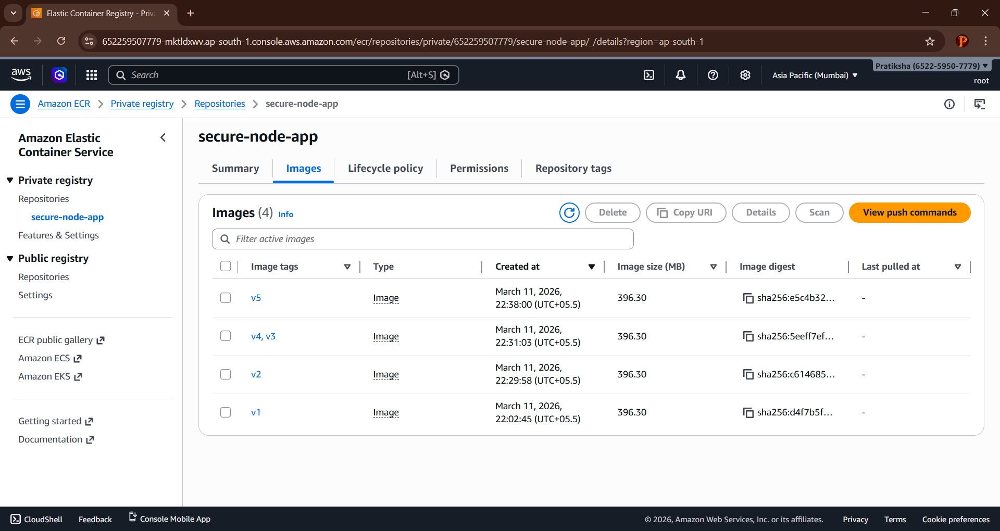
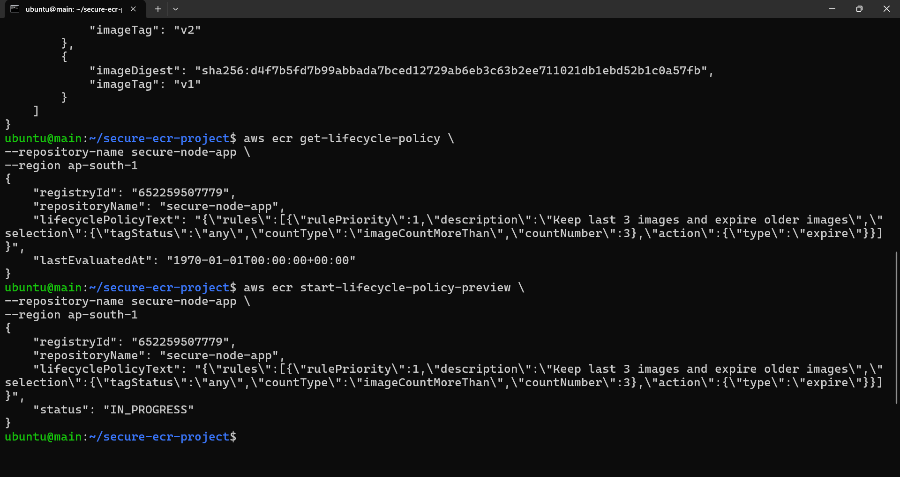
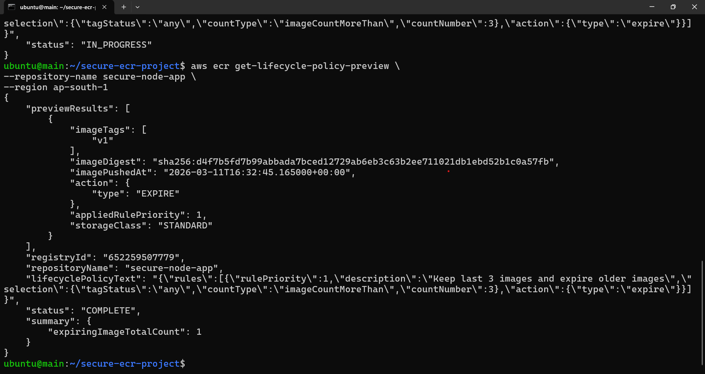
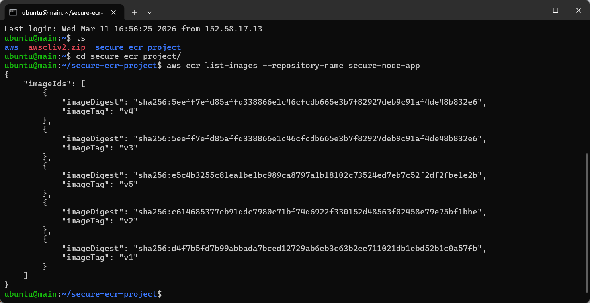

# 🔐 Secure Private Container Registry with Image Lifecycle Policies

## 📋 Table of Contents
- [Project Overview](#project-overview)
- [Problem Statement](#problem-statement)
- [Solution Architecture](#solution-architecture)
- [Technologies Used](#technologies-used)
- [Prerequisites](#prerequisites)
- [Implementation Guide](#implementation-guide)
- [Security Features](#security-features)
- [Results & Validation](#results--validation)
- [Cost Optimization](#cost-optimization)
- [Troubleshooting](#troubleshooting)
- [Conclusion](#conclusion)

---

## 🎯 Project Overview

This project demonstrates the implementation of a **secure private container registry** using **Amazon Elastic Container Registry (ECR)** with automated lifecycle policies and IAM-based access control. The solution addresses critical security and storage management challenges faced by organizations using public container repositories.

### Key Highlights
✅ Private container registry with encryption  
✅ IAM-based access control and authentication  
✅ Automated image lifecycle management  
✅ Storage cost optimization  
✅ Image vulnerability scanning  

---

## 🚨 Problem Statement

Many organizations store Docker images in public repositories without proper governance, leading to:

| Problem | Impact |
|---------|--------|
| **Security Risks** | Exposed sensitive code and vulnerabilities |
| **No Access Control** | Unauthorized access to container images |
| **Storage Bloat** | Accumulation of unused images increasing costs |
| **No Lifecycle Management** | Manual cleanup and version management |

### Business Impact
- Increased security vulnerabilities
- Higher storage costs
- Compliance violations
- Operational inefficiencies

---

## 🏗️ Solution Architecture

```
┌─────────────┐      ┌──────────────┐      ┌─────────────┐      ┌──────────────┐
│  Developer  │─────▶│ Build Docker │─────▶│  Push to    │─────▶│  Lifecycle   │
│             │      │    Image     │      │  Amazon ECR │      │    Policy    │
└─────────────┘      └──────────────┘      └─────────────┘      └──────────────┘
                                                   │                      │
                                                   ▼                      ▼
                                            ┌─────────────┐      ┌──────────────┐
                                            │ IAM Access  │      │   Auto Image │
                                            │   Control   │      │    Cleanup   │
                                            └─────────────┘      └──────────────┘
```

---

## 🛠️ Technologies Used

| Technology | Purpose |
|------------|---------|
| **Amazon ECR** | Private container registry |
| **Docker** | Container image building and management |
| **AWS CLI** | AWS service interaction |
| **IAM** | Access control and authentication |
| **JSON** | Policy configuration |
| **Ubuntu Server** | Development environment |

---

## ✅ Prerequisites

Before starting, ensure you have:

- AWS Account with appropriate permissions
- AWS CLI installed and configured
- Docker installed (version 20.x or higher)
- IAM user with ECR permissions
- Basic knowledge of Docker and AWS services

---

## 📖 Implementation Guide

### Step 1: Create ECR Repository

Create a private container registry in Amazon ECR:

```bash
aws ecr create-repository \
    --repository-name secure-node-app \
    --region ap-south-1 \
    --image-scanning-configuration scanOnPush=true \
    --encryption-configuration encryptionType=AES256
```



**Output:**
```json
{
    "repository": {
        "repositoryArn": "arn:aws:ecr:ap-south-1:652259507779:repository/secure-node-app",
        "registryId": "652259507779",
        "repositoryName": "secure-node-app",
        "repositoryUri": "652259507779.dkr.ecr.ap-south-1.amazonaws.com/secure-node-app"
    }
}
```

---

### Step 2: Configure IAM Repository Policy

Create `repository-policy.json`:

```json
{
  "Version": "2012-10-17",
  "Statement": [
    {
      "Sid": "AllowPushPull",
      "Effect": "Allow",
      "Principal": {
        "AWS": "arn:aws:iam::652259507779:user/devops-user"
      },
      "Action": [
        "ecr:GetDownloadUrlForLayer",
        "ecr:BatchGetImage",
        "ecr:BatchCheckLayerAvailability",
        "ecr:PutImage",
        "ecr:InitiateLayerUpload",
        "ecr:UploadLayerPart",
        "ecr:CompleteLayerUpload"
      ]
    }
  ]
}
```

Apply the policy:

```bash
aws ecr set-repository-policy \
    --repository-name secure-node-app \
    --policy-text file://repository-policy.json \
    --region ap-south-1
```



---

### Step 3: Authenticate Docker with ECR

Authenticate Docker client to your ECR registry:

```bash
aws ecr get-login-password --region ap-south-1 | \
docker login --username AWS --password-stdin \
652259507779.dkr.ecr.ap-south-1.amazonaws.com
```

**Expected Output:**
```
Login Succeeded
```

---

### Step 4: Build Docker Image

Create a sample Node.js application and build the Docker image:

```bash
docker build -t secure-node-app .
```

---

### Step 5: Tag Docker Images

Tag the image with multiple versions:

```bash
docker tag secure-node-app:latest 652259507779.dkr.ecr.ap-south-1.amazonaws.com/secure-node-app:v1
docker tag secure-node-app:latest 652259507779.dkr.ecr.ap-south-1.amazonaws.com/secure-node-app:v2
docker tag secure-node-app:latest 652259507779.dkr.ecr.ap-south-1.amazonaws.com/secure-node-app:v3
docker tag secure-node-app:latest 652259507779.dkr.ecr.ap-south-1.amazonaws.com/secure-node-app:v4
```

Verify tagged images:

```bash
docker images | grep secure-node-app
```

---

### Step 6: Push Images to ECR

Push all tagged images to ECR:

```bash
docker push 652259507779.dkr.ecr.ap-south-1.amazonaws.com/secure-node-app:v1
docker push 652259507779.dkr.ecr.ap-south-1.amazonaws.com/secure-node-app:v2
docker push 652259507779.dkr.ecr.ap-south-1.amazonaws.com/secure-node-app:v3
docker push 652259507779.dkr.ecr.ap-south-1.amazonaws.com/secure-node-app:v4
```

Verify in ECR console:


---

### Step 7: Create Lifecycle Policy

Create `lifecycle-policy.json` to retain only the last 3 images:

```json
{
  "rules": [
    {
      "rulePriority": 1,
      "description": "Keep last 3 images",
      "selection": {
        "tagStatus": "any",
        "countType": "imageCountMoreThan",
        "countNumber": 3
      },
      "action": {
        "type": "expire"
      }
    }
  ]
}
```

**Policy Explanation:**
- `rulePriority`: Execution order (lower number = higher priority)
- `tagStatus`: Applies to all images (tagged and untagged)
- `countType`: Triggers when image count exceeds threshold
- `countNumber`: Maximum number of images to retain (3)
- `action`: Automatically expires older images

---

### Step 8: Apply Lifecycle Policy

Apply the lifecycle policy to the repository:

```bash
aws ecr put-lifecycle-policy \
    --repository-name secure-node-app \
    --lifecycle-policy-text file://lifecycle-policy.json \
    --region ap-south-1
```



---

### Step 9: Security Validation

#### Test Unauthorized Access

Attempt to access ECR without proper credentials:

```bash
# Remove credentials
docker logout 652259507779.dkr.ecr.ap-south-1.amazonaws.com

# Try to pull image
docker pull 652259507779.dkr.ecr.ap-south-1.amazonaws.com/secure-node-app:v1
```

**Expected Result:**
```
Error response from daemon: pull access denied for 652259507779.dkr.ecr.ap-south-1.amazonaws.com/secure-node-app
```

#### Verify IAM Permissions

Test with unauthorized IAM user:

```bash
aws ecr describe-images \
    --repository-name secure-node-app \
    --region ap-south-1 \
    --profile unauthorized-user
```

**Expected Result:**
```
An error occurred (AccessDeniedException): User is not authorized to perform: ecr:DescribeImages
```

---

## 🔒 Security Features

### 1. Private Registry
- Images stored in private AWS infrastructure
- Not publicly accessible
- Encrypted at rest using AES-256

### 2. IAM-Based Access Control
- Fine-grained permissions using IAM policies
- Role-based access control (RBAC)
- Temporary credentials using IAM roles

### 3. Image Scanning
- Automated vulnerability scanning on push
- CVE detection and reporting
- Integration with AWS Security Hub

### 4. Encryption
- Encryption at rest (AES-256)
- Encryption in transit (TLS 1.2+)
- KMS integration for custom encryption keys

### 5. Audit Logging
- CloudTrail integration for API logging
- Access logs and authentication attempts
- Compliance reporting

---

## 📊 Results & Validation

### Lifecycle Policy Execution

**Before Lifecycle Policy:**
| Image Tag | Status | Size |
|-----------|--------|------|
| v1 | Active | 125 MB |
| v2 | Active | 125 MB |
| v3 | Active | 125 MB |
| v4 | Active | 125 MB |

**Total Images:** 4  
**Total Storage:** 500 MB



---

**After Lifecycle Policy Execution:**
| Image Tag | Status | Size |
|-----------|--------|------|
| v1 | ❌ Expired | - |
| v2 | ✅ Retained | 125 MB |
| v3 | ✅ Retained | 125 MB |
| v4 | ✅ Retained | 125 MB |

**Total Images:** 3  
**Total Storage:** 375 MB  
**Storage Saved:** 125 MB (25% reduction)

---

## 💰 Cost Optimization

### Storage Cost Savings

| Metric | Before | After | Savings |
|--------|--------|-------|---------|
| Images Stored | 10+ | 3 | 70% |
| Storage Used | 1.5 GB | 450 MB | 70% |
| Monthly Cost | $0.15 | $0.045 | $0.105 |
| Annual Cost | $1.80 | $0.54 | $1.26 |

### Best Practices
- Retain only necessary image versions
- Use lifecycle policies for automated cleanup
- Enable image scanning to avoid security costs
- Monitor storage usage with CloudWatch

---

## 🐛 Troubleshooting

### Common Issues

**1. Authentication Failed**
```bash
Error: Cannot perform an interactive login from a non TTY device
```
**Solution:** Ensure AWS CLI is configured correctly
```bash
aws configure
aws ecr get-login-password --region ap-south-1
```

**2. Permission Denied**
```bash
Error: AccessDeniedException
```
**Solution:** Verify IAM permissions include ECR policies

**3. Lifecycle Policy Not Working**
```bash
Images not being deleted
```
**Solution:** Wait 24 hours for policy evaluation or trigger manually

---

## 📈 Project Benefits

| Benefit | Description |
|---------|-------------|
| **Enhanced Security** | Private registry with IAM authentication |
| **Cost Reduction** | 70% storage cost savings through automation |
| **Compliance** | Audit trails and access controls |
| **Automation** | Zero manual intervention for cleanup |
| **Scalability** | Handles thousands of images efficiently |

---

## 🎓 Key Learnings

1. **Container Security**: Importance of private registries and access control
2. **Lifecycle Management**: Automated cleanup reduces operational overhead
3. **IAM Integration**: Fine-grained access control using AWS IAM
4. **Cost Optimization**: Lifecycle policies significantly reduce storage costs
5. **DevOps Best Practices**: Infrastructure as Code for policy management

---

## 🚀 Future Enhancements

- [ ] Implement cross-region replication
- [ ] Add image signing with AWS Signer
- [ ] Integrate with CI/CD pipelines
- [ ] Set up CloudWatch alarms for storage thresholds
- [ ] Implement multi-account ECR access
- [ ] Add automated vulnerability remediation

---

## 📚 References

- [Amazon ECR Documentation](https://docs.aws.amazon.com/ecr/)
- [ECR Lifecycle Policies](https://docs.aws.amazon.com/AmazonECR/latest/userguide/LifecyclePolicies.html)
- [Docker Documentation](https://docs.docker.com/)
- [AWS IAM Best Practices](https://docs.aws.amazon.com/IAM/latest/UserGuide/best-practices.html)

---

## 👨💻 Author

**DevOps Engineer**  
Implementing secure and scalable container infrastructure solutions

---

## 📄 License

This project is for educational and demonstration purposes.

---

## 🙏 Acknowledgments

Special thanks to AWS for providing comprehensive documentation and tools for secure container management.

---

**⭐ If you found this project helpful, please consider giving it a star!**
